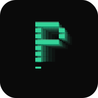
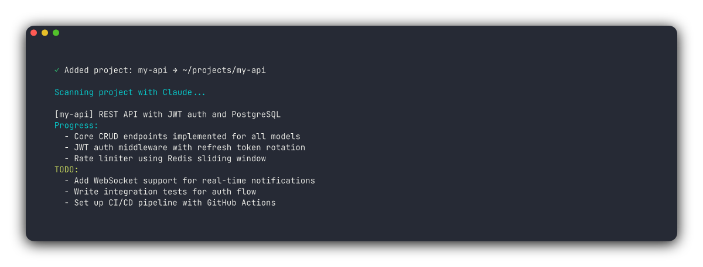
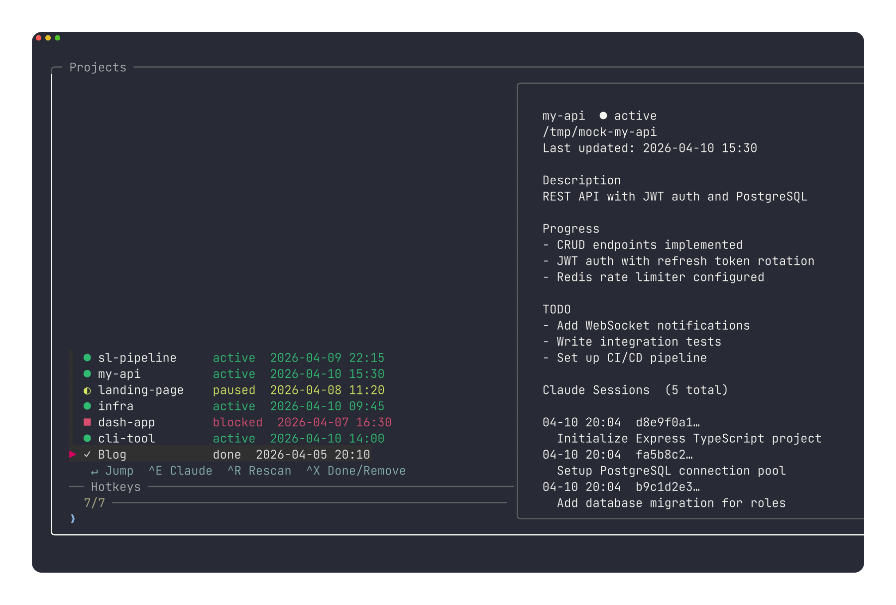

<div align="center">



# proj

**`zoxide` helps you `cd` faster. `proj` helps you remember what you were doing.**

Too many projects. Pick up any of them in 3 seconds.
Claude scans your code. proj tracks progress/TODO and helps you resume Claude Code sessions.

**~4600 lines of shell. No binary. No Node/Python/Go runtime. Loads in milliseconds.**

[](https://github.com/doctormin/proj/actions/workflows/ci.yml)
[](LICENSE)
[](#requirements)
[](#requirements)
[](https://docs.anthropic.com/en/docs/claude-code)
[](#)

[Features](#features) · [Install](#install) · [Why not X?](#why-not-x) · [Usage](#usage) · [Privacy](#privacy)

</div>

---

## The Problem

When you vibe-code across many projects, you lose context fast:
- **"Where was that project?"** — repos scattered across `~/projects`, `~/dev`, `~/Desktop/temp-thing`
- **"What was I doing?"** — no summary, no TODO, just stale `git log`
- **"Which Claude session?"** — you had a great conversation about the auth flow, good luck finding it
- **"What about that server project?"** — you SSH'd in, started something, completely forgot about it
- **"I was working on this at the office..."** — your home machine has no idea what you did

## The Fix

Run `proj add`, and Claude writes the summary for you:



Then type `proj` (or `Ctrl+P` from anywhere) — see progress, TODO, and Claude sessions for every project at a glance:



## Features

- **AI-Generated Progress & TODO** — Run `proj add`, and Claude writes the summary, progress, and TODO for you. Use `--no-scan` to skip, or `-y` to skip the large-repo confirmation prompt
- **Fuzzy Find & Jump** — `Ctrl+P` from anywhere, fuzzy search, press Enter to jump straight in. Smart filters: `proj :stale`, `proj :tag=backend`, `proj :remote`
- **Resume Claude Code Sessions** — One keystroke to resume your most recent Claude Code session. Preview shows session history and summaries
- **Remote Project Tracking** — `proj add-remote` with SSH reachability pre-flight, auto-detected `remote_shell` wrapper (zsh/bash/fish), and `--skip-check` for offline setups
- **Multi-Machine Sync** — `proj sync` keeps all metadata in sync via a private git repo. Tombstone sync propagates deletes across machines
- **Meta Session** — `proj meta` launches an AI advisor that knows all your projects. Ask "which project should I work on next?"
- **Project Scaffolding** — `proj new <template>` creates a project from bundled templates (node, python, rust, zsh-plugin) or your own
- **Tags** — `proj tag <name> <tag>`, filter by `proj :tag=backend`, see all tags with `proj tags`
- **Import & Export** — `proj import <file.json>`, `proj import zoxide`, `proj export` for backup or migration
- **History** — `proj history <name>` shows a timeline of status changes, edits, and tag events
- **Health Check** — `proj doctor` diagnoses environment, schema, sync status, and project integrity
- **Batch Operations** — `Tab` to multi-select in the panel, then `Ctrl-S` for batch status change or `Ctrl-D` for batch delete/done
- **Claude Status Detection** — Preview panel shows whether Claude Code is actively running for each project
- **Status Tracking** — `active` / `paused` / `blocked` / `done`, your prompt shows the count via Starship
- **Lightweight & Fast** — ~4600 lines, under 150 KB. Loads in milliseconds. Pure `zsh` shell script, no binary, no daemon, no background process. Plain text data you can `cat`, `grep`, or `git diff`
- **Cross-Platform** — macOS + Linux. Tab completion, `starship` integration, i18n (English / 中文)

## Requirements

- **`zsh`** (macOS default, `apt install zsh` on Linux)
- **[`fzf`](https://github.com/junegunn/fzf)** >= 0.38
- **[Claude Code](https://docs.anthropic.com/en/docs/claude-code)** (optional — for AI scanning, session resume, and meta advisor. Without it, you can still add/track/jump projects manually)
- Optional: [`starship`](https://starship.rs) (prompt integration), [`eza`](https://github.com/eza-community/eza) (pretty file listing), [`jq`](https://jqlang.github.io/jq/) (session preview)

## Install

### One-liner

```bash
git clone https://github.com/doctormin/proj.git ~/.proj-repo && ~/.proj-repo/install.sh
```

The installer will:
- Check for required dependencies (`zsh`, `fzf`) and warn about optional ones
- Copy files to `~/.proj/`
- Add one line to your `.zshrc`
- Optionally configure `starship` integration

### Quick Start (after install)

```bash
# 1. Restart your shell
exec zsh

# 2. Add your first project
cd ~/my-project && proj add

# 3. Open the panel
proj   # or Ctrl+P from anywhere
```

### Uninstall

```bash
~/.proj-repo/uninstall.sh        # Remove plugin, keep project data
~/.proj-repo/uninstall.sh --all  # Remove everything
```

## Why not X?

These are excellent adjacent tools, not direct substitutes.

| | **proj** | zoxide | tmuxinator | Agent Deck |
|---|----------|--------|------------|------------|
| Jump to project directories | Yes | Yes | — | Partial |
| AI project summary | Yes | — | — | — |
| Progress & TODO tracking | Yes | — | — | — |
| Claude session resume | Yes | — | — | Partial |
| Remote server projects | Yes | — | — | Yes |
| Multi-machine sync | Yes | — | — | — |
| AI project advisor | Yes | — | — | — |
| Core dependency model | `zsh` + `fzf` | Rust binary (~2 MB) | Ruby runtime (~50 MB) | Go binary + tmux |

**TL;DR:** `zoxide` helps you `cd` faster. `proj` helps you *remember what you were doing*. And it's just a shell script — nothing to compile, nothing to update. proj fills the gap none of them cover.

## Usage

### Local projects

```bash
proj add                          # Add current directory (Claude auto-scans)
proj add my-api ~/src/api         # Add with custom name and path
proj add --no-scan                # Skip Claude scan
proj add -y                       # Skip large-repo confirmation prompt
proj new python my-app ~/src      # Scaffold from template + register
```

### Remote projects

```bash
proj add-remote api user@server:/home/user/api
# SSH pre-flight checks connectivity + path existence
# Auto-detects remote shell (zsh/bash/fish)
# --skip-check to bypass the pre-flight
```

### Multi-machine sync

```bash
proj config sync-repo git@github.com:you/proj-sync.git  # Set up (once)
proj sync                         # Sync project metadata across machines
```

### AI project advisor

```bash
proj meta                         # Launch Meta Session
# Ask: "Which project should I work on next?"
# Ask: "Summarize all my TODOs across projects"
```

### Tags

```bash
proj tag my-api backend rust      # Add one or more tags
proj untag my-api rust            # Remove a tag
proj tags                         # List all tags with project counts
proj :tag=backend                 # Open panel filtered to a tag
```

### Import & export

```bash
proj import ~/repos               # Scan a directory for git repos
proj import zoxide                # Import from zoxide database
proj import data.json             # Import from a proj export file
proj export > backup.json         # Export all projects to JSON
```

### Other commands

```bash
proj                              # Open interactive panel (fzf)
proj cc [name]                    # Resume Claude Code session
proj scan [name]                  # Rescan with Claude Code
proj status <name> <state>        # Change status (active/paused/blocked/done)
proj edit <name> <field> <value>  # Edit field (desc/path/progress/todo)
proj ls [active|done]             # Compact one-line list (-v for verbose)
proj stale [days]                 # List projects not updated in N days
proj history <name>               # Show event timeline
proj doctor                       # Health check
proj config                       # Settings
proj --version                    # Show version
proj help                         # Show help
```

## Hotkeys

Inside the interactive panel (`proj` or `Ctrl+P`):

| Key | Action |
|-----|--------|
| `Enter` | Jump to project (cd for local, SSH for remote) |
| `Ctrl-E` | Resume Claude Code session |
| `Ctrl-R` | AI rescan progress & TODO |
| `Ctrl-X` | Mark done or remove project |
| `Tab` | Toggle multi-select on current row |
| `Ctrl-S` | Batch status change (all selected) |
| `Ctrl-D` | Batch delete/done (all selected) |
| `Ctrl-O` | Cycle sort: updated → name → status → progress |
| `Esc` | Exit panel |
| Type | Fuzzy search / filter |

Global (in any terminal):

| Key | Action |
|-----|--------|
| `Ctrl-P` | Open interactive panel |

## Configuration

```bash
proj config                       # Interactive settings menu
proj config lang zh               # Set Chinese
proj config lang en               # Set English
proj config sync-repo <git-url>   # Set sync repository
proj config remote_shell "zsh -ic" # Global remote shell wrapper
```

### Smart filters

Open the panel pre-filtered:

```bash
proj :active                      # By status
proj :stale                       # Not updated recently
proj :remote                      # Remote projects only
proj :tag=backend                 # By tag
proj :missing                     # Path no longer exists
```

Config is stored in `~/.proj/config`.

## Data Storage

```
~/.proj/
├── config                        # User settings
├── machine-id                    # UUID for multi-machine sync
├── schema_version                # Data format version
├── version                       # Installed version
├── meta/                         # Meta Session working directory
│   └── CLAUDE.md                 # Auto-generated project context (updated on `proj meta`)
├── .tombstones/                  # Cross-machine delete propagation
└── data/
    └── <project-name>/
        ├── path.<machine-id>     # Local path (per-machine)
        ├── type                  # "local" or "remote"
        ├── status                # active | paused | blocked | done
        ├── updated               # Last update timestamp
        ├── desc                  # AI-generated description
        ├── progress              # AI-generated progress
        ├── todo                  # AI-generated TODO
        ├── tags                  # Space-separated tag list
        ├── history.log           # Event timeline (UTC timestamps)
        ├── host                  # Remote only: user@hostname
        ├── remote_path           # Remote only: path on server
        └── remote_shell          # Remote only: shell wrapper (e.g., "zsh -ic")
```

Plain text files. No database. Easy to backup, sync, or edit by hand.

## Privacy

- **By default, project metadata stays local** in `~/.proj/` — plain text files you can read, edit, or delete anytime
- **If you use Claude features**, your code is sent to Anthropic via the [Claude Code CLI](https://docs.anthropic.com/en/docs/claude-code) for analysis (same as using Claude Code directly). See [Anthropic's data policy](https://www.anthropic.com/policies/privacy) for retention details
- **If you enable sync**, metadata only (descriptions, TODO, status) is pushed to a **private** git repo you control — no source code is ever synced
- **Without Claude Code**, proj still works — you can manually add projects, set descriptions, jump between them, and manage status
- **The install script** runs locally. It copies two files to `~/.proj/` and adds one line to `.zshrc`. No network calls, no telemetry, no sudo required
- **No telemetry, no analytics, no tracking**

## Troubleshooting

**`proj add` hangs or takes too long:**
Claude Code is scanning your project. Large repos take 5-15 seconds. If it fails, you can manually set fields with `proj edit <name> desc "your description"`.

**Claude Code not found:**
Install [Claude Code](https://docs.anthropic.com/en/docs/claude-code) for AI features. Without it, you can still use `proj add <name> <path>` + manual edits, jump with `proj`/`Ctrl+P`, and manage status.

**`Ctrl+P` doesn't work:**
Another `zsh` plugin may have bound `Ctrl+P`. Check with `bindkey '^P'`. `proj` binds it on load; whichever loads last wins.

**Remote project SSH fails:**
`proj` opens a new terminal window for SSH. If no terminal emulator is found, it prints the SSH command for manual use. Set `PROJ_TERMINAL` env var to specify your terminal app.

**Sync conflicts:**
Conflicts are extremely rare with single-user use. If they happen, `proj sync` will show the conflicted files. Resolve them manually in `~/.proj/data/` with standard git tools.

## Update

```bash
cd ~/.proj-repo && git pull && ./install.sh
```

## License

MIT

---

<div align="center">
<sub>Built with zsh, fzf & Claude Code · <a href="https://cc-proj.cc">cc-proj.cc</a></sub>
</div>
